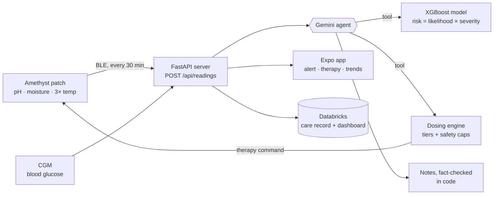
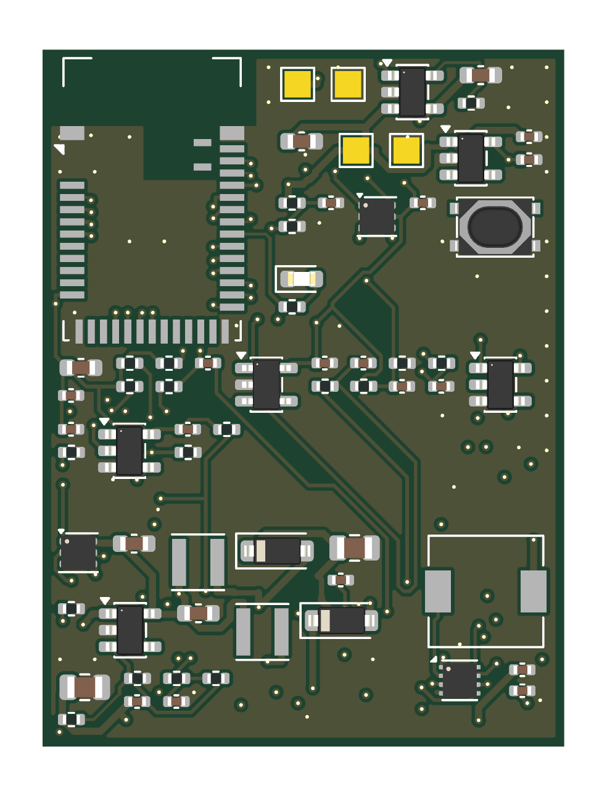
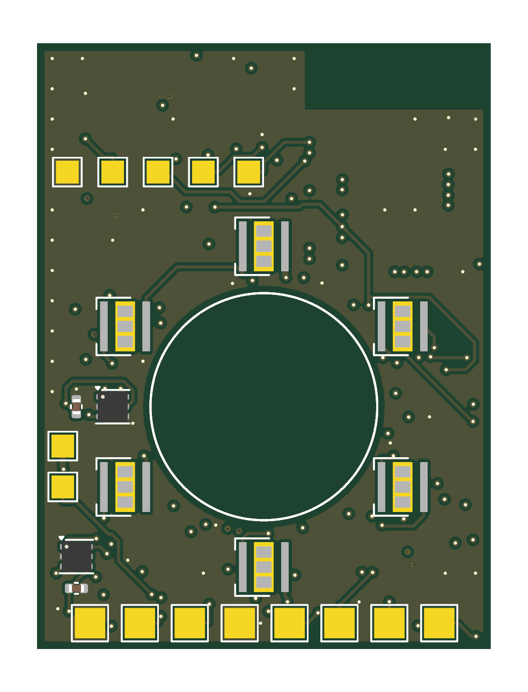

<div align="center">


### Smart wound care that catches infection early and treats it on the spot.

A wearable patch that senses infection before you can see it, scores the risk with an ML model,
has an AI agent check the evidence, and treats with **low-frequency ultrasound** and **405 nm violet light**.


**[Watch the 40-second film](remotion/renders/AmethystFilm.mp4)** · [How it works](#how-it-works) · [Quick start](#quick-start) · [The math](#the-math) · [Safety](#safety-in-three-layers)

</div>

---

## The problem

**60%** of diabetic foot ulcers become infected, and **15–20%** of diabetic foot infections end in amputation. Nerve damage removes pain, the body's warning sign, so infection often goes unnoticed until it's visible, and by then it's serious.

The early signs are measurable long before that. Infected wounds turn **alkaline** (healthy wounds sit at pH 4–6; infected ones at 7.5–9), get **warmer** and **wetter**, and bacteria use up the **glucose** in wound fluid. Amethyst watches for exactly those changes.

<sub>Sources: Diabetes Care; Nussbaum et al., *Value in Health* 2018. More in [`hardware/research/`](hardware/research/).</sub>

## How it works



1. **Sense.** Every 30 minutes the patch reads wound pH, moisture (impedance) and temperature at three spots (wound edge, healthy reference skin, ambient). Blood glucose comes from the wearer's CGM.
2. **Predict.** An XGBoost model compares each reading with the patient's **own first-day baseline** and outputs a 0–100 risk score and a tier: monitor, watch, treat or intensive.
3. **Reason.** A **Gemini agent** calls the model and the dosing engine as tools, then writes a clinician-ready assessment. It covers the trend, sensor faults, signals that disagree with the model, its confidence, and whether a clinician should look. **It never invents a number:** risk and doses always come from our code, and its notes are fact-checked against the tool results.
4. **Treat.** In the treat tier the patch runs ultrasound to break up biofilm, then 405 nm light to kill bacteria. Lower tiers get gentle healing ultrasound and closer monitoring.
5. **Alert.** The app shows the patient their risk, trends and therapy. Every reading and assessment lands in Databricks for the care team.

## Results

Validated **leave-one-person-out** (16 folds): every person is scored by a model that never saw their data.

| | Random forest | **XGBoost** (shipped) |
|---|---|---|
| AUC | 0.976 | **0.978** |
| Brier skill score | 0.834 | **0.845** |
| Infected wounds detected | 100% | **100%** |
| Median hours from onset to alarm | 30.3 | **27.2** |
| False alarms, clean wounds | **0.3%** | 2.1% |
| Model size | 11.9 MB | **3.1 MB** |
| Time per prediction | 12.4 ms | **0.14 ms** |

We shipped XGBoost: it alarms **3.1 h earlier** and is **3.8× smaller** and **89× faster**, which matters on a wearable. The extra false alarms are absorbed by risk smoothing and the agent's review.

Which sensors matter most (AUC of each sensor on its own): **moisture 0.952** · temperature 0.933 · pH 0.917 · wound glucose 0.886 · blood glucose 0.650 · pH + temp + moisture together **0.976**.

> All results are on simulated data (see [limits](#honest-limits)). The full method is in [`docs/ml-pipeline.md`](docs/ml-pipeline.md).

## The math

**Training data.** No public dataset of continuous wound-sensor readings with infection labels exists, so we simulated one from **30+ published studies** and **real Dexcom glucose traces from 16 people** (PhysioNet):

$$600 \text{ wounds} \times 14 \text{ days} \times 48 \text{ readings/day} = 403{,}200 \text{ labelled readings}$$

**Features.** 5 signals × (6 h median, change vs. day-1 baseline, 6 h change, 24 h change, 24 h std) + 2 time-of-day terms = **27 features**.

**Risk = likelihood × severity.** Trained on cleanly separated data, the classifier is near-certain for *any* sustained shift. So we scale its probability by how far the signs have actually moved toward a full infection:

$$p = P(\text{warning}) + P(\text{infection})$$

$$s = \text{mean of the 3 largest of } \left\{\frac{\Delta \text{pH}}{0.65},\ \ \frac{\Delta T}{1.6\,^{\circ}\text{C}},\ \ \frac{-\Delta \ln Z}{-\ln 0.65},\ \ \frac{-\Delta g / g_0}{0.40}\right\}$$

Each Δ is a 2 h median minus the patient's day-1 baseline. The denominators are a full infection's average effect in the simulator: pH +0.65, temperature +1.6 °C, impedance −35%, wound glucose −40%. Each term is clipped to [0, 1.25] and *s* to [0, 1]. Using the top 3 of 4 means a wound whose pH doesn't rise, which happens in real infections, still scores. The score is then smoothed so one noisy reading can't trigger treatment (τ = 3 h, Δt = 0.5 h):

$$R_t = R_{t-1} + \alpha\,(100\,p_t s_t - R_{t-1}), \qquad \alpha = \frac{0.5}{3 + 0.5} \approx 0.143$$

**Tiers** use 10-point hysteresis: each is entered at its threshold and left only 10 points below it, so the device doesn't flicker.

| Tier | Enter at | Therapy each 8 h session (3/day) |
|---|---|---|
| 0 · Monitor | — | 1.5 MHz healing ultrasound, 6.7 min (20 min/day ÷ 3) |
| 1 · Watch | 30 | Healing ultrasound + closer monitoring |
| 2 · Treat | 55 | Ultrasound to break biofilm → 405 nm light |
| 3 · Intensive | 80 | Same, scaled up toward the caps |

**Light dose** (treat tier and above) at 10 mW/cm², with the 36 J/cm² daily cap split over 3 sessions:

$$x = \text{clip}\!\left(\frac{R - 30}{60}, 0, 1\right), \qquad E = 12x \ \text{J/cm}^2, \qquad t = \frac{E}{0.010 \ \text{W/cm}^2}$$

**Ultrasound** (treat tier and above), run before the light:

$$y = \text{clip}\!\left(\frac{R - 55}{35}, 0, 1\right), \qquad t_{\text{US}} = \max(4,\ 10y) \ \text{min}, \qquad I = 0.1 + 0.4y \ \text{W/cm}^2$$

| Risk *R* | Light | Ultrasound |
|---|---|---|
| 55 (enters treat) | 5 J/cm² → **8.3 min** | 4 min at 0.10 W/cm² |
| 72.5 | 8.5 J/cm² → **14.2 min** | 5 min at 0.30 W/cm² |
| 100 | 12 J/cm² → **20 min** (3 × 12 = 36 J/cm²/day cap) | 10 min at 0.50 W/cm² |

## The AI agent

[`wound_agent/`](wound_agent/) wraps the model and dosing in three tools: `get_sensor_history` → `predict_infection` → `plan_treatment`. The LLM writes structured notes: `summary`, `trend`, `reasoning`, `data_quality_flags`, `conflicting_signals`, `recommend_clinician_review` and `confidence`.

- **Gemini by default.** Gemini 3.8 Flash with low thinking takes about 5 s and about $0.005 per assessment. `GEMINI_MODEL=gemini-3.1-pro-preview` with `GEMINI_THINKING=high` gives maximum care. OpenRouter and Claude Opus also work (`AGENT_PROVIDER=gemini|openrouter|claude`).
- **Fact-checked.** After the agent writes, code checks its notes against the tool results (risk score, tier, lifted patch, clinician review) and asks for one correction if anything is off.
- **Knows what to distrust.** It's told each sensor's standalone accuracy, that infections don't always raise pH, and how hysteresis works. In testing it caught a 43 °C reading as a sensor fault rather than a fever, and blamed a risk jump on a meal-time glucose spike while the wound sensors stayed healthy.
- **Never blocks the demo.** With no API key, the same model and dosing run and a rule-based summary stands in.

## Hardware

 

A reusable **30 × 40 mm, 4-layer** pod that clips onto a disposable hydrogel pad. [Full spec →](hardware/docs/board-spec.md)

| Block | Parts |
|---|---|
| Radio + MCU | Raytac MDBT42Q (nRF52832), Bluetooth LE |
| Temperature | 3× TMP117: wound edge, reference skin, ambient |
| Moisture | 1 kHz square wave through a 47 kΩ reference into the pad electrodes, read as impedance (no dedicated chip) |
| pH | AD8603 buffer on the working electrode |
| Light | 6× 405 nm LEDs, TPS61165 constant-current boost, PWM dimming |
| Ultrasound | 15 mm 30 kHz piezo disc, TPS61040 boost (5–10 V) + DRV8837 H-bridge + 4.7 mH resonant inductor |
| Power | Single LiPo, MCP73831 charger, AP2112K 3.3 V regulator |
| Extras | Pad-ID resistor, button for a daily pain/odour check-in, SWD debug pads |

**Generated, not drawn.** One Python file ([`design.py`](hardware/kicad/gen/design.py)) generates the schematic, places every part, autoroutes all **178 connections** and runs KiCad's electrical and design-rule checks in one command.

**Power and heat budget** ([details](hardware/experiments/out/power_thermal_results.md)):
- Sensing averages **~22 µA**, which is about **60 days on a 40 mAh cell**.
- At 10 mW/cm² of light, skin reaches 37.3 °C, or **38.7 °C on a poorly perfused diabetic foot**, including the LEDs' own heat. Both stay under our 41 °C ceiling.
- Doubling to 20 mW/cm² would hit 43.4 °C, so we didn't.

## Safety in three layers

| Layer | What it enforces |
|---|---|
| **1 · Software** ([`risk_to_dose.py`](risk_to_dose.py)) | Dose caps, tier hysteresis, no therapy when impedance > 150 kΩ (patch lifted) |
| **2 · Firmware** ([`firmware/`](firmware/)) | The same caps again, whatever the phone asks: 10 mW/cm², 36 J/cm²/day, 10 min of pulsed ultrasound (500 ms on / off), stop at 41 °C, and no session without a pad attached and on the skin, a working wound sensor, and battery > 3.5 V |
| **3 · Hardware** | Every TMP117 alert pin feeds AND gates on the light and ultrasound enables. At **42 °C**, therapy cuts out **even if the firmware has crashed** |

## Quick start

**Python 3.12+** (Adam's pinned numpy 2.5 and xgboost 3.4 need it).

```bash
python -m venv .venv
source .venv/bin/activate          # Windows: .venv\Scripts\activate
pip install -r requirements.txt
cp .env.example .env               # add GEMINI_API_KEY (or OPENROUTER_ / ANTHROPIC_API_KEY)
```

**Run the agent on a simulated wound:**

```bash
python main.py -v --scenario infected        # healthy | early_infection | infected | sensor_fault | patch_lifted
python main.py --history sample_data/simulated_wound_history.csv
python main.py --offline                     # model + dosing only, no LLM
```

**Live demo + hardware API** (then open http://localhost:8000):

```bash
python demo_ui/server.py
python demo_ui/send_reading.py --scenario infection --count 8 --every 3    # pretend to be the patch
```

| Endpoint | What |
|---|---|
| `POST /api/readings` | One patch reading in → risk, tier and therapy plan out |
| `GET /api/state` | Latest assessment (the app polls this) |
| `GET /api/events` | Server-sent events for every pipeline step |
| `POST /api/reset` | New patient with a fresh 24 h baseline |
| `GET /docs` | Interactive API docs |

**Phone app** (Expo Go):

```bash
cd app && npm install && npx expo start      # add --tunnel on campus Wi-Fi
```

**Firmware tests** (simulated board) and **board build** (KiCad 10):

```bash
cd firmware && make test && make arm-check
cd hardware/kicad && ./build.sh              # about 6 min with autorouting; --no-route for seconds
```

**Databricks care record** (landing from the `databricks` branch; design in [`docs/superpowers/specs/`](docs/superpowers/specs/)):

```bash
python main.py --databricks                  # readings + assessments to Databricks, care-team dashboard
```

**Film:**

```bash
cd remotion && npm install && npm run dev
```

**Tests:**

```bash
python -m pytest
```

## Repo map

| Path | What |
|---|---|
| [`wound_agent/`](wound_agent/) · [`main.py`](main.py) | AI agent: tools, prompts, providers, fact check, CLI |
| [`predict.py`](predict.py) · [`risk_to_dose.py`](risk_to_dose.py) · [`model/`](model/) | Trained XGBoost model, risk score, dosing engine |
| [`generate_data.py`](generate_data.py) · [`train_*.py`](train_final.py) · [`compare_models.py`](compare_models.py) | Simulator, training, RF vs. XGBoost, validation ([write-up](docs/ml-pipeline.md)) |
| [`research/`](research/) · [`hardware/research/`](hardware/research/) | Literature values for every simulator parameter, signal and dose, with sources |
| [`demo_ui/`](demo_ui/) | FastAPI server, hardware API, animated live demo |
| [`app/`](app/) | Expo companion app: Pair, Home, Alert, Therapy, Trends |
| [`hardware/`](hardware/) · [`firmware/`](firmware/) | KiCad board generator + board, C firmware with Zephyr port |
| [`remotion/`](remotion/) | Demo film and brand assets |
| [`tests/`](tests/) | Pipeline tests: scenarios, tiers, dose caps, interlock |

## Honest limits

- **Simulated training data.** The model has never seen a real wound. Retrain on real patch data before any clinical use.
- **Prototype doses** from published studies, not a validated medical protocol.
- **The board is designed and autorouted but not yet fabricated,** and the firmware has only run on a simulated board. Light and ultrasound intensity at the wound are estimates until measured.
- **Not all on the board yet.** The board's ultrasound runs at 30 kHz (within the 20–40 kHz range of clinical wound devices). The 1.5 MHz healing mode and wound-fluid glucose sensing aren't on this board yet.
- **Combining light and ultrasound** is backed by lab (in-vitro) studies so far.

## Team

Built at **WolfHacks 2026** by:
- **Adam Rakhmanov:** ML model, simulator, dosing, demo server.
- **Anay Vaidya:** hardware, firmware, Databricks.
- **Aarush:** app and film.
- **Suhaan Temkar:** AI agent.

<sub>Glucose data: BIG IDEAs Lab Glycemic Variability and Wearable Device Data v1.1.3, PhysioNet, ODC-By 1.0.</sub>
